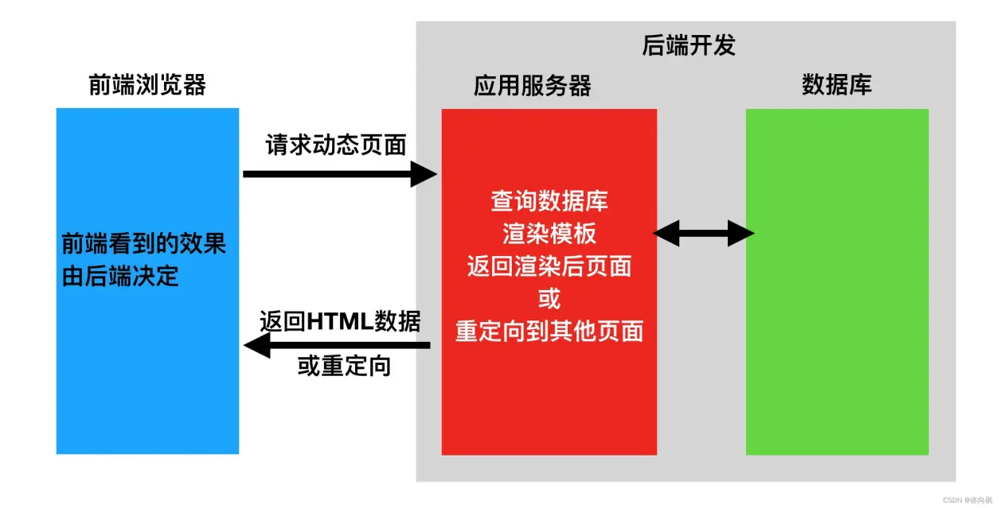

# fastapi

fastapi是是建立在Starlette和Pydantic基础上的，Pydantic是一个基于Python类型提示来定义数据验证、序列化和文档的库。Starlette是一种轻量级的ASGI框架/工具包，是构建高性能Asyncio服务的理性选择。 

- 快速：可与 NodeJS 和 Go 比肩的极高性能（归功于 Starlette 和 Pydantic），是最快的 Python web 框架之一。

- 高效编码：提高功能开发速度约 200％ 至 300％。

- 更少bug：减少约 40％ 的人为（开发者）导致错误。

- 智能：极佳的编辑器支持。处处皆可自动补全，减少调试时间。

- 简单：设计的易于使用和学习，阅读文档的时间更短。

- 简短：使代码重复最小化。通过不同的参数声明实现丰富功能。

- 健壮：生产可用级别的代码。还有自动生成的交互式文档。 


## 基础知识

### http请求

1. 什么是请求头请求体，响应头响应体
2. URL地址包括什么
3. get请求和post请求到底是什么
4. Content-Type是什么


#### 简介

HTTP协议是Hyper Text Transfer Protocol（超文本传输协议）的缩写,是用于万维网（WWW:World Wide Web ）服务器与本地浏览器之间传输超文本的传送协议。HTTP是一个属于应用层的面向对象的协议，由于其简捷、快速的方式，适用于分布式超媒体信息系统。它于1990年提出，经过几年的使用与发展，得到不断地完善和扩展。HTTP协议工作于客户端-服务端架构为上。浏览器作为HTTP客户端通过URL向HTTP服务端即WEB服务器发送所有请求。Web服务器根据接收到的请求后，向客户端发送响应信息。 


#### 协议特性

1. 基于TCP/IP协议 

   http协议是基于TCP/IP协议之上的应用层协议。

2. 基于请求－响应模式

   HTTP协议规定,请求从客户端发出,最后服务器端响应该请求并 返回。换句话说,肯定是先从客户端开始建立通信的,服务器端在没有 接收到请求之前不会发送响应。

3. 无状态保存

   HTTP是一种不保存状态,即无状态(stateless)协议。HTTP协议 自身不对请求和响应之间的通信状态进行保存。也就是说在HTTP这个 级别,协议对于发送过的请求或响应都不做持久化处理 

   使用HTTP协议,每当有新的请求发送时,就会有对应的新响应产 生。协议本身并不保留之前一切的请求或响应报文的信息。这是为了更快地处理大量事务,确保协议的可伸缩性,而特意把HTTP协议设计成 如此简单的。 

4. 短链接

   HTTP1.0默认使用的是短连接。浏览器和服务器每进行一次HTTP操作，就建立一次连接，任务结束就中断连接。
   HTTP/1.1起，默认使用长连接。要使用长连接，客户端和服务器的HTTP首部的Connection都要设置为keep-alive，才能支持长连接。
   HTTP长连接，指的是复用TCP连接。多个HTTP请求可以复用同一个TCP连接，这就节省了TCP连接建立和断开的消耗。 

## http请求协议与响应协议


http协议包含由浏览器发送数据到服务器需要遵循的请求协议与服务器发送数据到浏览器需要遵循的请求协议。用于HTTP协议交互的信被为HTTP报文。请求端(客户端)的HTTP报文 做请求报文,响应端(服务器端)的 做响应报文。HTTP报文本身是由多行数据构成的字文本。


一个完整的URL包括：协议、ip、端口、路径、参数

例如： https://www.baidu.com/s?wd=yuan 其中https是协议，www.baidu.com 是IP，端口默认80，/s是路径，参数是wd=yuan

请求方式: get与post请求（经过演变过后还有put，delete请求）

- GET提交的数据会放在URL之后，以?分割URL和传输数据，参数之间以&相连，如EditBook?name=test1&id=123456. POST方法是把提交的数据放在HTTP包的请求体中.

- GET提交的数据大小有限制（因为浏览器对URL的长度有限制），而POST方法提交的数据没有限制

响应状态码：状态码的职 是当客户端向服务器端发送请求时, 返回的请求 结果。借助状态码,用户可以知道服务器端是正常 理了请求,还是出 现了 。状态码如200 OK,以3位数字和原因 组成。 


### api接口

在开发Web应用中，有两种应用模式：

1. 前后端不分离[客户端看到的内容和所有界面效果都是由服务端提供出来的。] 

   

   

2. 前后端分离【把前端的界面效果(html，css，js分离到另一个服务端，python服务端只需要返回数据即可)】

   前端形成一个独立的网站，服务端构成一个独立的网站 
   
   
   
   应用程序编程接口（Application Programming Interface，API接口），就是应用程序对外提供了一个操作数据的入口，这个入口可以是一个函数或类方法，也可以是一个url地址或者一个网络地址。当客户端调用这个入口，应用程序则会执行对应代码操作，给客户端完成相对应的功能。
   
   当然，api接口在工作中是比较常见的开发内容，有时候，我们会调用其他人编写的api接口，有时候，我们也需要提供api接口给其他人操作。由此就会带来一个问题，api接口往往都是一个函数、类方法、或者url或其他网络地址，不断是哪一种，当api接口编写过程中，我们都要考虑一个问题就是这个接口应该怎么编写？接口怎么写的更加容易维护和清晰，这就需要大家在调用或者编写api接口的时候要有一个明确的编写规范！！！
   
   为了在团队内部形成共识、防止个人习惯差异引起的混乱，我们都需要找到一种大家都觉得很好的接口实现规范，而且这种规范能够让后端写的接口，用途一目了然，减少客户端和服务端双方之间的合作成本。
   
   目前市面上大部分公司开发人员使用的接口实现规范主要有：restful、RPC。
   
   REST全称是Representational State Transfer，中文意思是表述（编者注：通常译为表征）性状态转移。 它首次出现在2000年Roy Fielding的博士论文中。
   
   RESTful是一种专门为Web 开发而定义API接口的设计风格，尤其适用于前后端分离的应用模式中。
   
   关键：面向资源开发
   
   这种风格的理念认为后端开发任务就是提供数据的，对外提供的是数据资源的访问接口，所以在定义接口时，客户端访问的URL路径就表示这种要操作的数据资源。
   
   而对于数据资源分别使用POST、DELETE、GET、UPDATE等请求动作来表达对数据的增删查改。 
   
   | 请求方法 | 请求地址    | 后端操作          |
   | -------- | ----------- | ----------------- |
   | GET      | /students   | 获取所有学生      |
   | POST     | /students   | 增加学生          |
   | GET      | /students/1 | 获取编号为1的学生 |
   | PUT      | /students/1 | 修改编号为1的学生 |
   | DELETE   | /students/1 | 删除编号为1的学生 |


restful规范是一种通用的规范，不限制语言和开发框架的使用。事实上，我们可以使用任何一门语言，任何一个框架都可以实现符合restful规范的API接口。 

### quick start

安装

```bash
conda install -c conda-forge fastapi
conda install -c conda-forge uvicirn
```

```python
from fastapi import FastAPI
import uvicorn

app = FastAPI()

@app.get("/")
def index():
    return {"message":"Hello World!!!"}


if __name__ == "__main__":
    uvicirn.run("main:app",host="127.0.0.1",port = 5000,reload = True,debug = True)
```

==注意：host是网址，当为127.0.0.1时表示为本地部署，只能在本地进行访问，而0.0.0.0，是线上部署，可以通过公网ip:端口号来进行访问==

fastapi非常棒的交互式 API 文档，这一点很吸引人。

跳转到 http://127.0.0.1:5000/docs。你将会看到自动生成的交互式 API 文档。 


### 路径操作

fastapi支持各种请求方式：

```python
@app.get()					
@app.post()
@app.put()
@app.patch()
@app.delete()
@app.options()
@app.head()
@app.trace()
```

路径操作装饰器参数：


```python
@app.post(
   "/items/{item_id}",
   response_model=Item,
   status_code=status.HTTP_200_OK,
   tags=["AAA"],
   summary="this is summary",
   description="this is description",
   response_description= "this is response_description",
   deprecated=False,
) 
```

路由分发机制

为了保持代码的干净、可读与修改性能，往往不会讲代码一股脑地全部塞到main里面，路由分发就是基于此种需求，例如在购买系统中将商店界面用户个人信息界面的代码与活动区分开，商户上架新商品走的全是商户下的路由。

```python
# apps\user\api\url.py
from fastapi import APIRouter

user = APIRouter(prefix="/user",tag=["user"])

@user.get("/login',summary="这是一个登录接口",description="主要用来登录")

async def user_login():

    return {"user":"login"}

```

```python
from fastapi import FastAPI
import uvicorn
from apps.user.api.url import user

app = FastAPI()

app.include_router(user)

@app.get("/")
async def index():
    return {"message":"你好！！！"}

if __name__ == "__main__":
    uvicorn.run("main:app",host="127.0.0.1",port=5000,debug=True,reload=True)
```

## 请求与响应

### 路径参数

#### 基本用法

以使用与 Python 格式化字符串相同的语法来声明路径"参数"或"变量"：

```python
@app.get("/user/{user_id}")
def get_user(user_id):
    print(user_id, type(user_id))
    return {"user_id": user_id}
```

#### 有类型的路径参数

你可以使用标准的 Python 类型标注为函数中的路径参数声明类型。

```python
@app.get("/user/{user_id}")
def get_user(user_id: int):
   print(user_id, type(user_id))
   return {"user_id": user_id}

在这个例子中，user_id 被声明为 int 类型。
```

这将为你的函数提供编辑器支持，包括错误检查、代码补全等等。 

#### 顺序

路径参数 user_id 的值将作为参数 user_id 传递给你的函数。 
在创建路径操作时，会发现有些情况下路径是固定的。

比如/users/me，假设它用来获取关于当前用户的数据.

然后，还可以使用路径/user/{username}来通过用户名 获取关于特定用户的数据。

由于路径操作是按顺序依次运行的，需要确保路径/user/me声明在路径/user/{username}之前

### 查询参数

路径函数中声明不属于路径参数的其他函数参数时，它们将被自动解释为"查询字符串"参数，也就是 url?之后用&分割的key=value键值对

```python
@app.get("/jobs/{kd}")
async def search_jobs(kd:str, city:Union[str, None]=None, xl:Union[str, None]=None):
    # 函数有默认值代表请求时不一定要填，否则是必须
    if city or xl:
        return {"kd": kd, "city": city, "xl": xl}
    return {"kd": kd}
```

自python3.5开始，python引入了类型注解(type hints)，typing的主要作用有：

1. 类型检查，防止运行时出现参数、返回值类型不符。

2. 作为开发文档附加说明，方便使用者调用时传入和返回参数类型。

3. 模块加入不会影响程序的运行不会报正式的错误，pycharm支持typing检查错误时会出现黄色警告。

type hints主要是要指示函数的输入和输出的数据类型，数据类型在typing 包中，基本类型有str list dict等等，

Union 是当有多种可能的数据类型时使用，比如函数有可能根据不同情况有时返回str或返回list，那么就可以写成Union[list, str]   Optional 是Union的一个简化， 当 数据类型中有可能是None时，比如有可能是str也有可能是None，则Optional[str], 相当于Union[str, None]

### 请求体数据

当需要将数据从客户端（例如浏览器）通过请求发送给服务器时，数据将其作为「请求体」发送。请求体请求携带 的数据。响应体是响应携带的数据。

```python
@book_urls.post("/")
async def add_book(new_book = Body()):
    ALL_BOOKS.append(new_book)
```

当你需要将数据从客户端（例如浏览器）发送给 API 时，你将其作为「请求体」发送。请求体是客户端发送给 API 的数据。响应体是 API 发送给客户端的数据。

FastAPI 基于 Pydantic ，Pydantic 主要用来做类型强制检查（校验数据）。不符合类型要求就会抛出异常。

对于 API 服务，支持类型检查非常有用，会让服务更加健壮，也会加快开发速度，因为开发者再也不用自己写一行一行的做类型检查。 

稍微讲下async在做什么：

fastapi支持异步，异步：遇到阻塞操作可以选择不等阻塞操作执行完，去执行其他代码

async def 定义一个 不开多线程的异步函数（协程函数）。
也就是说，这个函数可以在执行到“可能会阻塞”的地方（比如网络请求、数据库I/O、文件操作等）时，主动让出执行权，去让事件循环（event loop）运行别的任务。

协程实现的异步编程允许在单线程下同时处理多个任务：当某个任务因为I/O操作被挂起时，事件循环会自动切换去执行其他任务，从而提高系统的并发能力。

事件循环事件循环是一个不断监视和调度任务的机制，用来在等待I/O时切换执行其他协程，从而实现异步并发。

事件循环像一个“调度员”：

1. 它维护一个任务队列（所有等待运行的协程任务）。

2. 每个协程执行到 某个“异步I/O操作”时（需要在操作前加await)，会告诉调度员： “我现在在等I/O结果，可以先去跑别人。”

3. 事件循环于是暂时挂起这个协程，把CPU交给其他任务。

4. 等I/O操作完成后（比如文件读完、数据库返回了），系统会通知事件循环：
       “我准备好了！”
5. 事件循环再把该任务放回队列，恢复它的执行。

FastAPI 另一大组件 Pydantic，Pydantic主要用来做类型强制检查（校验数据）。不符合类型要求就会抛出异常。

对于 API实现，支持类型检查非常有用，会让API实现更加健壮，也会加快开发速度，因为开发者再也不用自己写一行一行的做类型检查。

```bash
conda activate 你的fastapi环境

conda install pydantic

conda install -c conda-forge email-validator   # 用于邮箱验证
```

```python
from pydantic import BaseModel, Field, field_validator, EmailStr
from datetime import date
from typing import Optional, Union, List


class Addr(BaseModel):
    province: str
    city: str


class User(BaseModel):
    name: str = "root"  # 默认值
    age: int = Field(default=0, gt=0, lt=100)
    birth: Union[date, None] = None
    friends: List[int] = []
    description: Optional[str] = None
    addr: Addr  # 嵌套类型
    email: EmailStr

    @field_validator("name")
    @classmethod
    def name_must_alpha(cls, value):
        assert value.isalpha(), 'name must be alpha'
        return value

    @field_validator("birth")  # 校验birth
    def my_date_validator(cls, value):
        if value is None:
            return value
        assert value <= date.today(), "date is invalid"
        return value


class Data(BaseModel):
    data: List[User]


@book_urls.post("/user")
async def user(shuju: User):
    print(shuju, type(shuju))
    print(shuju.name, shuju.birth)
    print(shuju.model_dump()) # Model转成字典
    return {}

```

和声明查询参数时一样，当一个模型属性具有默认值时，它不是必需的。否则它是一个必需属性。将默认值设为None可使其成为可选属性。

FastAPI 会自动将定义的模型类转化为JSON Schema，Schema 成为 OpenAPI 生成模式的一部分，并显示在 API 交互文档中，查看 API 交互文档如下，该接口将接收application/json类型的参数。

FastAPI 支持同时定义 Path 参数、Query 参数和请求体参数，FastAPI 将会正确识别并获取数据。

参数在 url 中也声明了，它将被解释为 path 参数

参数是单一类型（例如int、float、str、bool等），它将被解释为 query 参数

参数类型为继承 Pydantic 模块的BaseModel类的数据模型类，则它将被解释为请求体参数

### form表单数据

有时候数据需要作为表单字段（urlencoded格式）发送，而不是JSON

FastAPI 可以使用Form组件来接收表单数据，需要先使用 conda install -c conda-forge python-multipart 命令进行安装。

注意：conda安装的 不和 pip安装的一起记录，尽量要conda 安装，conda-forge由社区管理各种软件包，conda install失败，可以加上conda-forge；conda-forge再失败再考虑用pip

```python
from fastapi import Form, HTTPException


@app04.post("/regin")
async def data(username:str=Form(max_length=16, min_length=8, regex='[a-zA-Z]'), password:str = Form(max_length=16, min_length=8, regex='[0-9]'):
    return {"username": username}
```

在 OAuth2 规范的一种使用方式（密码流）中，需要将用户名、密码作为表单字段发送，而不是 JSON。 

### 文件上传

文件上传也要遵守http协议，content-type是multipart/formdata。

```python
# 适合小文件上传
@book_urls.post("/file")
async def get_file(file: bytes = File()):
    print("file", file)
    return {"file": len(file)}


@book_urls.post("/files")
async def get_files(files: List[bytes] = File()):
    for file in files:
        print(len(file))
    return {"file": len(files)}


# 上传大文件
@book_urls.post("/uploadFile")
async def get_file(file: UploadFile):
    # 可以操作file.file
    print("file", file)

    with open(f"{file.filename}", "wb") as f:
        for chunk in iter(lambda: file.file.read(1024), b''):
            f.write(chunk)

    return {
        "file": file.filename,
    }


@book_urls.post("/uploadFiles")
async def getUploadFiles(files: List[UploadFile]):
    print("file", files)
    return {}
```

iter(lambda: f.read(1024), b'')
是 Python 的特殊语法：不断调用函数 lambda: f.read(1024)，直到返回值等于 b'' 为止。
它相当于一个优雅的 while 循环。

uploadFile类：
1. 文件小于阈值（默认 1MB） → 存在内存
2. 文件大于阈值 → 临时写入磁盘

### Request对象

有些情况下我们希望能直接访问Request对象。例如我们在路径操作函数中想获取客户端的IP地址，需要在函数中声明Request类型的参数，FastAPI 就会自动传递 Request 对象给这个参数，我们就可以获取到 Request 对象及其属性信息，例如 header、url、cookie、session 等。

```python
from fastapi import Request


@app.get("/items")
async def items(request: Request):
    return {
        "请求URL: ": request.url,
        "请求ip": request.client.host,
        "请求宿主": request.headers.get("user-agent"),
        "cookies": request.cookies,
    }
```

Cookie和Session的简单讲解

- Cookie(客户端存储）

	Cookie是服务器发送到用户浏览器并保存在本地的一小块数据。
	
	特点：
	
	1. 存储在客户端（浏览器）
	
	2. 每次请求会自动携带对应的Cookie
	
	3. 大小限制越4KB
	
	4. 可以设置过期时间
	
	常见用途：
	
	5. 用户偏好设置（语言，主题等）
	
	6. 购物车信息
	
	7. 用户登录状态保持
	
-  Session（服务器端存储）

	特点：
	
	1. 存储在服务器内存或数据库中
	2. 更安全，敏感数据不会暴露给客户端
	3. 通常通过Session ID来标识用户
	4. Session ID通常通过Cookie传递
	
	工作流程：
	1. 用户登录时，服务器创建Session并生成Session ID
	2. Session ID通过Cookie发送给浏览器
	3. 浏览器后续请求自动携带Session ID
	4. 服务器通过Session ID查找用户对应数据

### 请求静态文件

在Web开发中，需要请求很多静态资源文件（不是由服务器生成的文件），如css/js和图片文件等

```python
from fastapi.staticfiles import StaticFiles

app = FastAPI()
app.mount("/static", StaticFiles(directory="static"))

# 1. 文件服务：将本地static/目录下的文件通过Web提供访问
# 2. 路径映射：把URL路径/static映射到物理目录 static
# 3. 自动处理：自动处理文件读取，MIME类型识别
```

`StaticFiles(directory="static(path)")`里面的地址必须是在服务器真是存在的，路径出发点是主路由(app)所在的同级目录

### 响应模型相关参数

#### response_model

前面写的这么多路径函数最终 return 的都是自定义结构的字典，FastAPI 提供了 response_model 参数，声明 return 响应体的模型

```python
@app.post("/items/", response_model=Item)
async def create_item(item: Item):
```

response_model 是路径操作的参数，并不是路径函数的参数哦

FastAPI将使用response_model进行以下操作：

1. 将输出数据转换为response_model中声明的数据类型。

2. 验证数据结构和类型

3. 将输出数据限制为该model定义的

4. 添加到OpenAPI中

在自动文档系统中使用。

可以在任意的路径操作中使用response_model参数来声明用于响应的模型

案例：

注册功能

输入账号、密码、昵称、邮箱，注册成功后返回个人信息

```python
from typing import Union

from fastapi import FastAPI
from pydantic import BaseModel, EmailStr

app = FastAPI()

class UserReq(BaseModel):
    username: str
    password: str
    email: EmailStr
    full_name: Union[str, None] = None

class UserRes(BaseModel):
    username: str
    email: EmailStr
    full_name: Union[str, None] = None

@app.post("/user/", response_model=UserRes)
async def create_user(user: UserReq):
    return user

```

#### response_model_exclude_unset

通过上面的例子，我们学到了如何用response_model控制响应体结构，但是如果它们实际上没有存储，则可能要从结果中忽略它们。例如，如果model在NoSQL数据库中具有很多可选属性，但是不想发送很长的JSON响应，其中包含默认值。

```python
from typing import Union, List

from fastapi import FastAPI
from pydantic import BaseModel, EmailStr

app = FastAPI()

class Item(BaseModel):
    name: str
    description: Union[str, None] = None
    price: float
    tax: float = 10.5
    tags: List[str] = []

items = {
"foo": {"name": "Foo", "price": 50.2},
"bar": {"name": "Bar", "description": "The bartenders", "price": 62, "tax": 20.2},
"baz": {"name": "Baz", "description": None, "price": 50.2, "tax": 10.5, "tags": []},
}

# 请求http://localhost:8080/items/foo, 对比设置unset参数 和 不设置 unset参数

@app.get("/items/{item_id}", response_model=Item, response_model_exclude_unset=True)
async def read_item(item_id: str):
    return items[item_id]
```

使用路径操作装饰器的response_model参数来定义响应模型，特别是确保私有数据被过滤掉。使用response_model_exclude_unset来仅返回显式设定的值。 除了response_model_exclude_unset以外，还有response_model_exclude_defaults和response_model_exclude_none，我们可以很直观的了解到他们的意思，不返回是默认值的字段和不返回是None的字段。

#### INCLUDE 和 EXCLUDE

```python
# response_model_exclude
@app.get("/items/{item_id}", response_model=Item, response_model_exclude={"description"})
async def read_item(item_id: str):
    return items[item_id]

# reponse_model_include
@app.get("/items/{item_id}", response_model=Item, response_model_include={"name", "price"})
async def read_item(item_id: str):
    return items[item_id]
```

## jinja2模板

要了解jinja2，那么需要先理解模板的概念。模板在Python的web开发中⼴泛使⽤，它能够有效的将业务逻辑和页⾯逻辑分开，使代码可读性增强、并且更加容易理解和维护。  模板简单来说就是⼀个其中包涵占位变量表⽰动态的部分的⽂件，模板⽂件在经过动态赋值后，返回给⽤户。

jinja2是Flask作者开发的⼀个模板系统，起初是仿django模板的⼀个模板引擎，为Flask提供模板⽀持，由于其灵活，快速和安全等优点被⼴泛使⽤。

在jinja2中，存在两种语法：

1. 变量取值 {{ }}

2. 控制结构 

### jinja2的变量

```python
from fastapi import FastAPI, Request
from fastapi.templating import Jinja2Templates

app = FastAPI() # 实例化FastAPI对象
templates = Jinja2Templates(directory="templates") # 实例化Jinja2对象，并将文件夹路径设置为以templates命名的文件夹

@app.get("/")
def hello(request: Request):
    return templates.TemplateResponse(
        "index.html",

        {"request": request, # 注意，返回模板响应时，必须由request键值对，且值为Request请求对象，它确保了模板功能的完整性
         'user': 'someone',
         'books': ["python深度学习第三版", "聊斋", "西游记", "红楼梦"],
         'booksDict':{
             "python深度学习第三版": {"price":100, "publish": "人民邮电出版社"},
             "聊斋": {"price":150, "publish": "橘子出版社"},
            }
         }
    )
```

```html
<!DOCTYPE html>
<html>
<head>
    <meta charset="UTF-8">
    <title>Title</title>
</head>
<body>

<h1>{{ user}}</h1>

<p>{{ books.0 }}</p>
<p>{{ books.1 }}</p>
<p>{{ books.2 }}</p>
<p>{{ books.3 }}</p>

<p>{{ booksDict.金瓶梅.price }}</p>

</body>
</html>
```

### jinja2的过滤器

| 过滤器名称  | 说明                                         |
| ----------- | -------------------------------------------- |
| capitialize | 把值的首字母转换成大写，其他字母转换为小写   |
| lower       | 把值转换成小写形式                           |
| title       | 把值中每个单词的首字母都转换成大写           |
| trim        | 把值的首尾空格去掉                           |
| striptags   | 渲染之前把值中所有的HTML标签都删掉           |
| join        | 拼接多个值为字符串                           |
| round       | 默认对数字进行四舍五入，也可以用参数进行控制 |
| safe        | 渲染时值不转义                               |

如何使⽤这些过滤器呢？只需要在变量后⾯使⽤管道(|)分割，多个过滤器可以链式调⽤，前⼀个过滤器的输出会作为后⼀个过滤器的输⼊。


{{ 'abc'| captialize }} # Abc

{{ 'abc'| upper }} # ABC

{{ 'hello world'| title }} # Hello World

{{ "hello world"| replace('world','xxx') | upper }} # HELLO xxx

{{ 18.18 | round | int }} # 18

商品: {{ items|join(', ') }}  # 假设items通过python这边传给模板：[apple, banana, orange] 显示: apple, banana, orange

### jinja2控制结构

#### 分支控制

jinja2中的if语句类似与Python的if语句，它也具有单分⽀，多分⽀等多种结构，不同的是，条件语句不需要使⽤冒号结尾，⽽结束控制语句，需要使⽤endif关键字

```html


<p>会员区</p>



<p>非会员区</p>


```

#### 循环控制

jinja2中的for循环⽤于迭代Python的数据类型，包括列表，元组和字典。在jinja2中不存在while循环。


<p>{{ book }}</p>


```python
# Python 后端
@app.get("/company")
async def company(request: Request):
    company_info = {
        'name': '科技公司',
        'departments': {
            '技术部': {'manager': '张经理', 'staff_count': 20},
            '销售部': {'manager': '李经理', 'staff_count': 15},
            '人事部': {'manager': '王经理', 'staff_count': 8}
        }
    }
    return templates.TemplateResponse("company.html", {"request": request, "company": company_info})

# company.html
"""
<h3>{{ company.name }}</h3>

<div>
    <h4>{{ dept_name }}</h4>
    <p>经理: {{ dept_info.manager }}</p>
    <p>员工数: {{ dept_info.staff_count }}</p>
</div>

"""
```

## ORM

1. ORM用来做什么的？

ORM（对象关系映射）用来通过操作Python对象来操作数据库，而不需要直接写SQL语句。
简单说：让Python类和对象与数据库表和记录之间自动转换。

下载tortoise-orm

通过继承orm里的Model类，定义数据表，模拟学校选课系统：学生表，教师表，课程表，班级表

定义数据表后，main.py里把数据库模型注册进app

```python
app = FastAPI()
register_tortoise(app, config=settings.TORTOISE_CONNECTION)
```

Tortoise ORM文档

Tortoise ORM 目前支持以下数据库：

- PostgreSQL >= 9.4（使用asyncpg）

- SQLite（使用aiosqlite）

- MySQL/MariaDB（使用aiomysql或使用asyncmy）


2. 数据库迁移工具在做什么？

**数据库迁移工具在同步代码模型与数据库结构的变化**

具体做三件事：
1. **生成迁移脚本** - 比较模型变化，生成SQL变更文件
2. **版本管理** - 记录当前数据库版本，追踪迁移历史
3. **执行变更** - 按顺序执行迁移脚本，升级或回滚数据库结构

**本质**：让数据库结构随着代码模型演变而安全地自动更新

下载aerich

下载aiomysql

数据库迁移执行流程，更详细的操作步骤+结果：https://www.bilibili.com/read/cv42280929/?opus_fallback=1
1. aerich init -t settings.TORTOISE_ORM
2. aerich init-db
3. 数据库变更后（添加字段，添加表），重新生成迁移文件：aerich migrate --name 操作记录名称
4. 最终执行变更的迁移：aerich upgrade
5. 其他操作：回退：aerich downgrade，查看历史记录：aerich history


1. 一对一关系
    **一个记录只关联另一个表的一个记录**
    - 外键放在任意一方，加唯一约束
    - 如：用户 ←→ 身份证

2. 一对多关系
    **一个记录关联另一个表的多个记录**
    - 外键放在"多"的一方
    - 如：部门(一) ← 员工(多)

3. 多对多关系
    **一个记录关联多个记录，反之亦然**
    - 需要关联表（中间表）包含两个外键
    - 如：学生 ← 选课表 → 课程

4. 实现方式
    - **外键**：指向另一表主键的字段
    - **关联表**：专门存储多对多关系的表，包含两个外键

**核心**：外键定义关系方向，关联表解决多对多。

### 具体操作流程

#### 创建模型

```python
# /models.py
from tortoise.models import Model
from tortoise import firld

class Klass(Modle):
    id = fields.IntField(pk = True,description="班级号")
    name = fields.CharField(max_length=32,description="班级名")
class Student(Model):
    id = fields.IntField(pk=True)
    name = fields.CharField(max_length=32, description="姓名")
    # age = fields.IntField()
    sno = fields.IntField(description="学号")
    pwd = fields.CharField(max_length=32)

    klass = fields.ForeignKeyField("models.Klass", related_name="students")
    course = fields.ManyToManyField("models.Course", related_name="students")
    
class Course(Model):
    id = fields.IntField(pk=True)
    name = fields.CharField(max_length=32,default="",description="课程名称")
    
    teacher = fields.ForeignKeyField("models.Teacher", related_name="courses")
    
class Teacher(Model):
    id = fields.IntField(pk = True)
    name = fields.CharField(max_length=32,description="教师姓名")
    tno = fields.IntField(description="教师工号")
    pwd = fields.CharField(max_length=32)

```

pk代表主键

```python
# /main.py
import uvicorn
from fastapi import FastAPI
from tortoise.contrib.fastapi import register_tortoise
from settings import TORTOISE_ORM

register_tortoise(
   app,
   config=TORTOISE_ORM,)
   # generate_schemas=True,  # 如果数据库为空，则自动生成对应表单，生产环境不要开
   # add_exception_handlers=True,  # 生产环境不要开，会泄露调试信息 
```

在main.py中将orm的配置信息导入并在tortoise.contrib.fastapi里的config参数上传入，tortoise.contrib.fastapi是专为fastapi留下的接口

```python
# /settings.py
TORTOISE_ORM = {
   'connections': {
       'default': {
           # 'engine': 'tortoise.backends.asyncpg',  PostgreSQL
           'engine': 'tortoise.backends.mysql',  # MySQL or Mariadb
           'credentials': {
               'host': '127.0.0.1',
               'port': '3306',
               'user': '用户名',
               'password': '数据库的密码',
               'database': '数据库名称',
               'minsize': 1,
               'maxsize': 5,
               'charset': 'utf8mb4',
               "echo": True
           }
       },
   },
   'apps': {
       'models': {
           'models': ['apps.models', "aerich.models"],
           'default_connection': 'default',

       }
   },
   'use_tz': False,
   'timezone': 'Asia/Shanghai'
}
```

此时数据库迁移的部分算是准备的差不多，接下来正式迁移

```bash
$ conda activate 环境名

$ cd path # path 是settings.py和main.py所在的目录

$ aerich init -t settings.TORTOISE_ORM

$ aerich init-db
```

当数据库升级，即当models.py的表结构进行改变时，需要从新生成迁移文件，在升级

```bash
$ aerich migrate --name 操作记录名称

$ aerich upgrade
```

也可以查看迁移记录和版本回退

```bash
$ aerich downgrade		# 版本回退

$ aerich history		# 查看历史
```

### api接口与restful规范

### API 接口

应用程序编程接口（Application Programming Interface，API 接口），就是应用程序对外提供了一个操作数据的入口，这个入口可以是一个函数或类方法，也可以是一个 url 地址或者一个网络地址。当客户端调用这个入口，应用程序则会执行对应代码操作，给客户端完成相对应的功能。

当然，API 接口在工作中是比较常见的开发内容，有时候，我们会调用其他人编写的 API 接口，有时候，我们也需要提供 API 接口给其他人操作。由此就会带来一个问题，API 接口往往都是一个函数、类方法、或者 url 或其他网络地址，不同是哪一种，当 API 接口编写过程中，我们都要考虑一个问题就是这个接口应该怎么编写？接口怎么写的更加容易维护和清晰，这就需要大家在调用或者编写 API 接口的时候要有一个明确的编写规范！

### RESTful 规范

为了在团队内部形成共识、防止个人习惯差异引起的混乱，我们都需要找到一种大家都觉得很好的接口实现规范，而且这种规范能够让后端写的接口，用途一目了然，减少客户端和服务端双方之间的合作成本。

目前市面上大部分公司开发人员使用的接口实现规范主要有：RESTful、RPC。

REST 与技术无关，代表的是一种软件架构风格，REST 是 Representational State Transfer 的简称，中文翻译为"表征状态转移"或"表现层状态转化"。

简单来说，REST 的含义就是客户端与 Web 服务器之间进行交互的时候，使用 HTTP 协议中的 4 个请求方法代表不同的动作。

- **GET** 用来获取资源
- **POST** 用来新建资源
- **PUT** 用来更新资源
- **DELETE** 用来删除资源

只要 API 程序遵循了 REST 风格，那就可以称其为 RESTful API。目前在前端分离的架构中，前后端基本都是通过 RESTful API 来进行交互。

例如，我们现在要编写一个选课系统的接口，我们可以查询对一个学生进行查询、创建、更新和删除等操作，我们在编写程序的时候就要设计客户端浏览器与我们 Web 服务端交互的方式和路径。

而对于数据资源分别使用 POST、DELETE、GET、UPDATE 等请求来表达对数据的增删改查操作。

| 请求方法 | 请求地址    | 后端操作          |
| -------- | ----------- | ----------------- |
| GET      | /students   | 获取所有学生      |
| POST     | /students   | 增加学生          |
| GET      | /students/1 | 获取编号为1的学生 |
| PUT      | /students/1 | 修改编号为1的学生 |
| DELETE   | /students/1 | 删除编号为1的学生 |

## Students接口开发

### 获取学生

```python
# ORM操作示例

@student_api.get("/")
async def get_all_students():
    # 0. 查询所有记录
    students = await Student.all()
    print(students, type(students))

    # 1. 过滤
    student_1 = await Student.filter(klass_id=392)
    print(student_1, type(student_1))
    for student in student_1:
        print(student.name, student.birthday, student.klass_id)

    # 2. 过滤，但精确查一条记录
    student_2 = await Student.get(id=3)
    print(student_2, type(student_2))

    # 3. 条件查询
    student_3 = await Student.filter(klass_id__lt=390)

    # 小于（列名__lt), 大于（列名__gt), between...and...(列名__range), IN (列名__in)
    for student in student_3:
        print(student.name, student.birthday, student.klass_id)

    # 4. 其他的条件查询：
    # student_4 = await Student.filter(klass_id__not=390)  # 不等于

    # AND（默认就是AND）
    student_and = await Student.filter(
        klass_id__gt=300,
        klass_id__lt=400  # 两个条件同时满足
    )

    # OR 查询
    from tortoise.expressions import Q
    student_or = await Student.filter(
        Q(klass_id=390) | Q(klass_id=400)  # klass_id=390 OR klass_id=400
    )

    # 包含
    name_contains = await Student.filter(name__contains="张")  # LIKE '%张%'

    # 开头匹配
    name_startswith = await Student.filter(name__startswith="张")  # LIKE '张%'

    # 空值检查
    null_check = await Student.filter(klass_id__isnull=True)  # IS NULL

    # 排除
    exclude_result = await Student.exclude(klass_id=390)  # NOT klass_id=390

    # 5. 对表进行列选择
    student_5 = await Student.filter(klass_id__gt=390).values("name", "sno") # [{}, {}, {}]
    for student in student_5:
        print(student["name"], student["sno"])
    return {"query result": students}
```

```html
# students渲染到模板
"""
<ul>

    <li>{{ student.name }} - {{ student.sno }}</li>

</ul>
"""
```

### 添加学生

需要注意的点：

1. 用pydantic的BaseModel限制请求体的数据类型，可以用validator添加对字段的自定义限制
2. 多对多关系的添加：不能直接给学生的courses属性添加课程id，需要从Course表里找到对应的课程记录，再加到学生的courses里
3. 注意数据库操作要await

```python
# 添加学生示例
class StudentModel(BaseModel):
    name: str
    pwd: str
    sno: int
    klass_id: Union[int, None] = None
    courses: List[int] = []

api_student = APIRouter()

@api_student.post("/student")
async def addStudent(stu: StudentModel):
    # 添加数据库操作
    # 方式1
    # student = Student(name=stu.name, pwd=stu.pwd, sno=stu.sno, clas_id=stu.clas)
    # await student.save()

    # 方式2
    student = await Student.create(
        name=stu.name,
        pwd=stu.pwd,
        sno=stu.sno,
        clas_id=stu.clas_id
    )
    print(student, dir(student))

    # 添加多对多关系记录
    courses = await Course.filter(id__in=stu.courses)
    print("courses", courses)
    await student.courses.add(*courses)
    print("student", student.courses)

    return student
```

假设要查学生具体在哪个班，具体报了什么课，这个涉及一对一，一对多的查询，SQL里靠多表连接查，ORM里的操作方式如下：

```python
# 查询学生和班级名称
async def get_student_klass():
    # 方法1：直接通过外键关系查询
    students = await Student.all().select_related("klass")
    for student in students:
        print(f"学生: {student.name}, 班级: {student.klass.name}")

    # 方法2：使用values查询特定字段
    # 单个学生.klass.values("name")
    result = await Student.all().values(
        "name",
        "sno",
        "klass__name"  # 双下划线访问关联字段
    )
    for item in result:
        print(f"学生: {item['name']}, 学号: {item['sno']}, 班级: {item['klass__name']}")

# 查询学生和课程
async def get_student_courses():
    # 方法1：预取关联数据
    students = await Student.all().prefetch_related("courses")
    for student in students:
        course_names = [course.name for course in student.courses]
        print(f"学生: {student.name}, 课程: {', '.join(course_names)}")

    # 方法2：直接所有学生班级名称 + 报课， 学生报多个课，该学生字典会出现多次
    # 单个学生.courses.values("teacher__name")
    students = await Student.all().values("name", "klass__name", "courses__name")

    # 方法3：查询特定学生的课程
    student = await Student.filter(name="张三").prefetch_related("courses").first()
    if student:
        for course in student.courses:
            print(f"课程: {course.name}")

# 一次性查询所有关联信息
async def get_student_full_info():
    students = await Student.all().select_related("klass").prefetch_related("courses")

    for student in students:
        print(f"学生: {student.name}")
        print(f"班级: {student.klass.name if student.klass else '无'}")
        print("课程:", [course.name for course in student.courses])
        print("-" * 30)

# 查询特定班级的学生
async def get_students_by_klass(klass_name):
    students = await Student.filter(klass__name=klass_name).select_related("klass")
    for student in students:
        print(f"学生: {student.name}, 班级: {student.klass.name}")

# 查询选修特定课程的学生
async def get_students_by_course(course_name):
    students = await Student.filter(courses__name=course_name).prefetch_related("courses")
    for student in students:
        print(f"学生: {student.name}, 课程: {course_name}")
```

select_related("klass") - 用于外键（一对多）

prefetch_related("courses") - 用于多对多

klass__name - 双下划线访问关联对象字段

filter(klass__name="xxx") - 双下划线在过滤条件中使用

### 修改学生

流程：
1. 根据id找学生，请求体里的数据和StudentModel一致
2. 对找到的学生直接调用update(name=..., sno=..., klass_id=...)
3. 多对多关系要单独更新：通过新的课程id找到课程记录，把原来的课程记录清空，然后再加入更新的课程记录

```python
@api_student.put("/student/{student_id}")
async def update_student(student_id: int, student: StudentModel):
    try:
        # 检查学生是否存在
        existing_student = await Student.get_or_none(id=student_id)
        if not existing_student:
            raise HTTPException(status_code=404, detail=f"Student {student_id} not found")

        # 准备更新数据
        data = student.model_dump(exclude_unset=True)
        courses = data.pop("courses", [])
        print(data, courses)

        # 更新学生基本信息
        await Student.filter(id=student_id).update(**data)

        # 更新学生的课程关系
        if courses:
            course_objs = await Course.filter(id__in=courses)
            await existing_student.courses.clear()
            await existing_student.courses.add(*course_objs)

        # 返回更新后的学生信息
        updated_student = await Student.get(id=student_id)
        return updated_student

    except Exception as e:
        return {"error": f"更新失败: {str(e)}"}
```

### 删除学生

注意：
1. 对查询结果删除会返回删除的数量，数量为0可以触发fastapi的HTTPException
2. 观察级联删除：学生删了，学生-课程表里的注册内容也会被删

```python
@api_student.delete("/student/{student_id}")
async def delete_student(student_id: int):
    deleted_count = await Student.filter(id=student_id).delete()
    if not deleted_count:
        raise HTTPException(status_code=404, detail=f"Student {student_id} not found")
    return {}
```

## 用户认证

### 项目组织架构

外部请求 $\xrightarrow{\text{调用 API 接口}}$ Controller 层 $\xrightarrow{\text{调用业务逻辑}}$ Service 层 $\xrightarrow{\text{调用数据操作}}$ DAO 层 $\xrightarrow{\text{读写}}$ 数据库

### 密码不存明文

1. conda install passlib
2. conda install -c conda-forge bcrypt==4.0.1
3. 构建crypto context： bcrypt_context = CryptContext(schemes=["bcrypt"], deprecated="auto")  # 固定用法
4. 用哈希函数把密码加密： bcrypt_context.hash()


